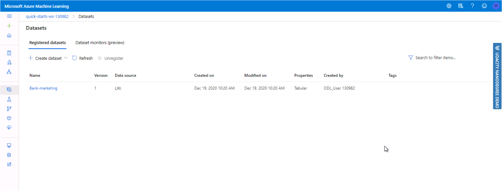
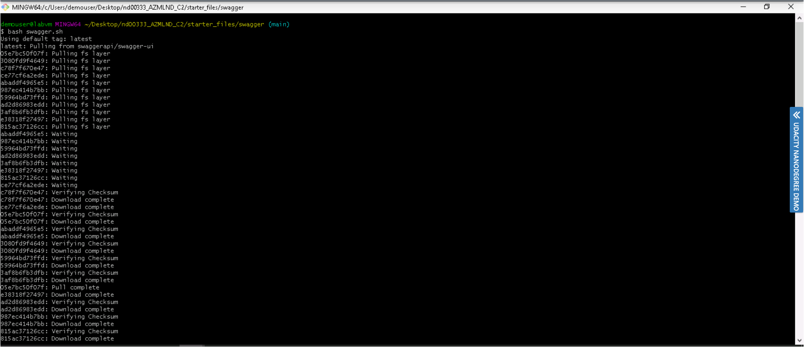

# Operationalizing Machine Learning in Azure

## Overview
In this project, we demonstrated end-to-end ML. i.e. we used Microsoft Azure to configure and create a model, deploy it, and consume it, also we create, publish, and consume a pipeline. The main aim of this project was to learn about operationalizing machine learning by deploying a model so that we get an endpoint URL that can easily be accessible by the end-user.

The main steps performed in the project are:
1. Creating Automated ML model
1. Deploy the model(Creating cluster configuration and compute targets and get models into production.)
1. Consuming an endpoint(Consume endpoints to interact with a deployed model in Azure ML Studio.)
1. Pipeline automation

## Dataset

The dataset contains data about the direct marketing campaigns of a Portuguese banking institution. The marketing campaigns were based on phone calls. The goal is to use classification to predict if the client will subscribe(0/1) to a term deposit(target variable y).

__Input Variables:__ age, job(type of job), marital(marital status), education etc.

**Predict Variable(desired target):** y - Has the client subscribe to a term deposit? (binary: “1”, means “Yes”, “0” means “No”)
## Architectural Diagram

We need to train an automated ML model and save it(or registered it). Once a model is trained we can deploy the model. **Model deployment** is the method to integrate a machine learning model into an existing production environment. Once deployed, you can monitor your model.

We will deploy a model using Azure Container Instances (ACI).

Advantage of Azure Container Instances (ACI).
* You need to quickly deploy and validate your model. You do not need to create ACI containers ahead of time. They are created as part of the deployment process.

## Summary

Project main steps
In this project, you will following the below steps:

* Automated ML Experiment
* Deploy the best model
* Enable logging
* Swagger Documentation
* Consume model endpoints
* Create and publish a pipeline

## Key Steps

#### 1. Automated ML Experiment

* Select and upload the Bankmarketing dataset: 
Register the dataset from the provided URL using TabularDatasetFactory in the notebook.

* Experiment is completed: 
In this step, we created an Automated ML model using a registered dataset, creating a compute cluster, and running the model.  

* Models of Automated ML run. 
After the experiment run completes, a summary of all the models and their metrics are shown. In the Models tab, the best model comes up first (at the top).

* Best model of Automated ML run. 
The best model is a model with the highest accuracy. 

* Best model run 
The Best Model is shown in the Details tab.

#### 2. Deploy the best model

Deploying the Best Model will allow to interact with the HTTP API service and interact with the model by sending data over POST requests.

* Select best model for the deployment

* Deploy model
 Enable Authentication and use Azure Container Instance(ACI).

* Successful Model deployment

#### 3. Enable logging

* **Enable Application Insights** for the deployed model.
 Application Insights is a very useful tool to detect anomalies, visualize performance.
  * Running the logs.py script enables one to view the logs.

Application Insight
 

 Logs after running the script logs.py

 

 

#### 4. Swagger Documentation

Swagger is a tool that helps build, document, and consume RESTful web services like the ones you are deploying in Azure ML Studio. It further explains what types of HTTP request that an API can consume.

Azure provides a swagger.json that is used to create a web site that documents the HTTP endpoint for a deployed model.

Running *serve.py* enables the content of swagger.json to be consumed locally by swagger. It starts the python server on port 8000.

* Open the browser and go to http://localhost:8000 where serve.py should list the contents of the directory.

*swagger.sh* downloads the latest Swagger container and it will run on port 9000. A container is running on  http://localhost:9000.

* Logs of swagger.sh

* Swagger UI

Interaction with API can be done using GET and POST methods

* POST method

* Types of response

* Models

#### 5. Consume model endpoints

We can interact with the endpoint using the *endpoint.py* script. The script issues a POST request to the deployed model and gets a JSON response that gets printed to the terminal.

* JSON response

#### 6. Create and publish a pipeline

##### Create a pipeline
The following steps are performed while creating a pipeline.
* Load dataset
* Create AutoML step
* Create a pipeline object
* Submit Experiment
* Retrieve the best model

* Pipeline created

* Pipeline run completed

* Bankmarketing dataset with AutoML module

* Pipeline endpoints

* Completed step using the RunDetails Widget in Jupyter Notebook

##### Publish a pipeline

* Published pipeline

* Publish Pipeline overview

## Screen Recording

[Screencast](https://drive.google.com/file/d/1ZkgG_PRPYA5m_btR2mByuk8x6U1xh-Vf/view?usp=sharing)
## Standout Suggestions

For the AutoML step,
* You can use more data to improve accuracy.
* We set the featurization parameter of AutoML class to 'auto'. We can improve the model by customizing the featurization of AutoML class. To customize the featurization step, provide a FeaturizationConfig object.
 Types preprocessing/featurization is done as follows:
  * Categorical: Target encoding, one-hot encoding, drop high cardinality categories, impute missing values.
  * Numeric: Impute missing values, cluster distance, the weight of evidence.
  * DateTime: Several features such as day, seconds, minutes, hours, etc.  
  * Text: Bag of words, pre-trained Word embedding, text target encoding.
